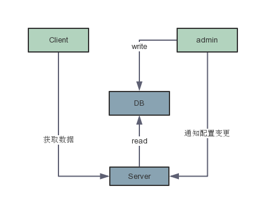
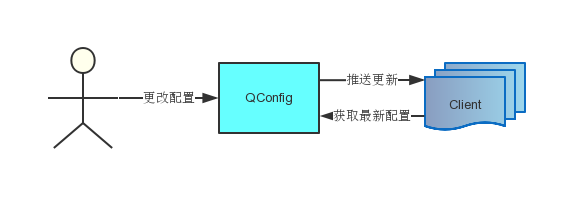

# 整体设计

架构如下

基础模型如下图所示

### 1 模型

一次发布操作通过如下流程完成发布操作

1. 用户在admin端完成发布操作
2. admin端通过http接口通知所有server端当前文件由新的发布版本，同时Server也有定时任务进行补偿。
3. Server通过已建立的长链接完成对Client的通知

### 2. QConfig数据模型

在QConfig中，所有的配置以及相关的数据最终都被存放在数据库中。主要模型如下

1. config_candidate_snapshot 每次的文件变更都会被存放到其中。
2. Config_candidate 存放每个文件最新版本的索引。
3. Config 存放每个文件最新发布版本的索引
4. config_snapshot 存放被发布或被推送的文件

### 2. Server设计

#### 2.1 Server发现

Server之前通过内置的eureka进行相互发现。同时，根据eureka探活结果，返回server的entryPoint。

选择eureka的原因如下

1. Server被设计为只读且无状态的，不存在一致性问题。
2. 需要尽量减小外部依赖。

根据以上两点即选择了eureka。

#### 2.2 Server数据模型

Server使用了两级缓存的方式来提升配置的获取速度。第一层缓存在内存中，主要用于针对热点数据，以降低磁盘IO。第二层指持久化在磁盘中的文件，当数据从数据库中读取会，便会持久化在磁盘中，以降低数据库瓶颈。

当Server收到数据请求时，会首先检查内存中是否存在缓存，如果没有，则会去获取文件。最后才是去获取数据库中的数据

#### 2.3 admin与Client的Server发现

admin与Client之间，使用域名的方式访问server的entrypoint接口，由ng负责从域名到server的负载均衡等操作。

Server的entrypoint接口会返回无序的在线Server列表。

### 3 Client的设计

1. Client与Server之间通过保持长链接来保证应用更新的及时推送。
2. client会将文件在内存中缓存，同时还会持久化到磁盘中，以保证极端状况下正常恢复。
3. Client通过Spring的注解机制来实现注解的扫描。

