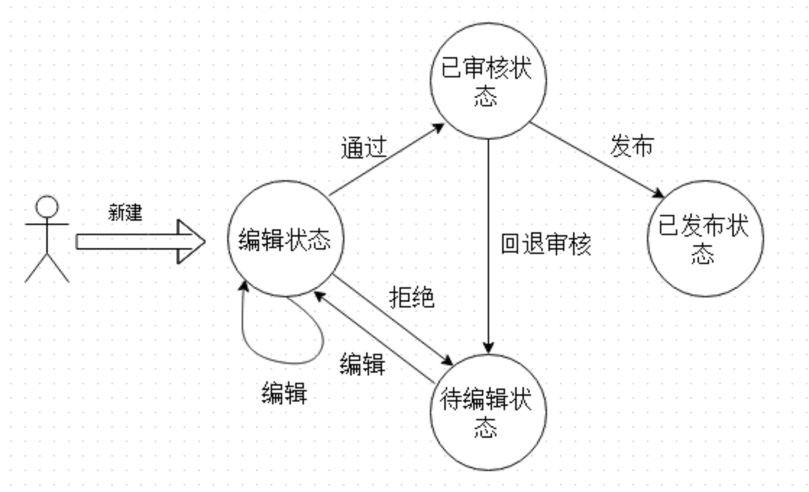
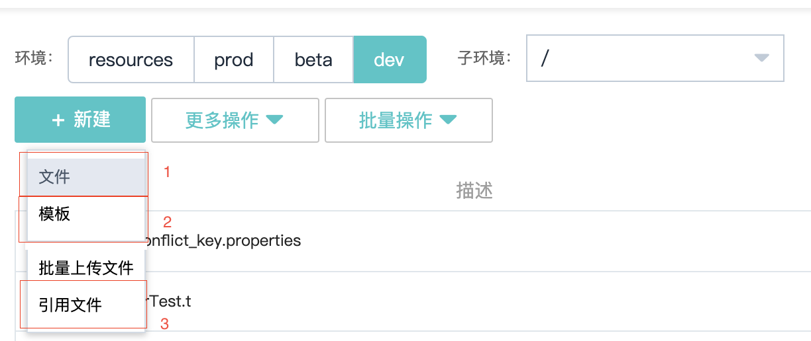
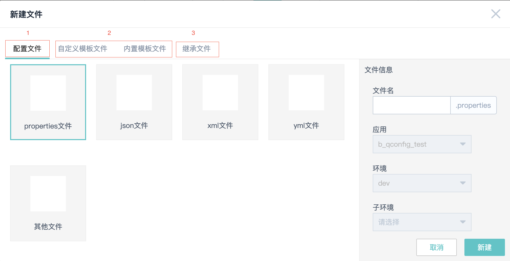
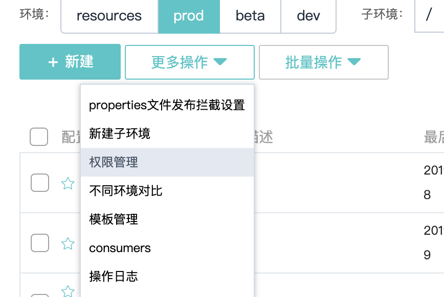
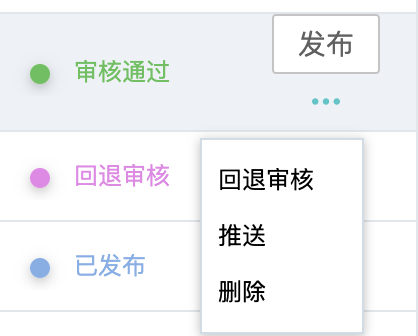
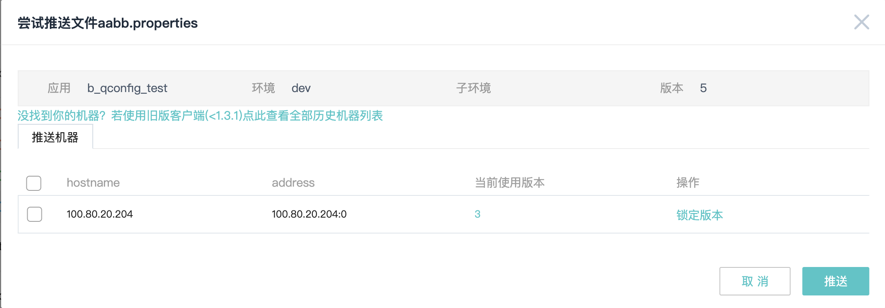
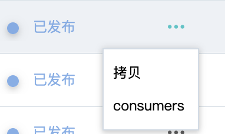
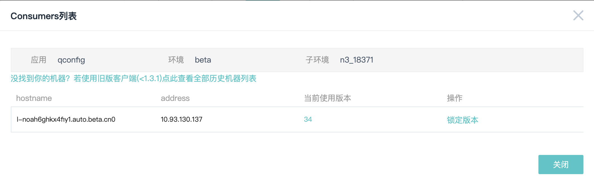
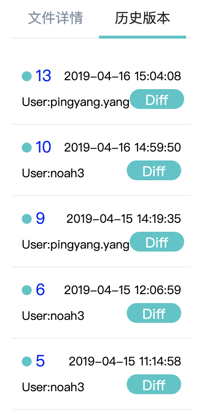
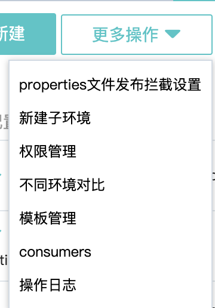

# 后台使用指南

[TOC]

## 文件管理

下图为QConfig配置文件发布流程 

#### 子环境

有的时候我们会在dev, beta甚至prod部署多套环境，而不同环境的配置也不相同,配置中心可以为不同的环境提供不同的配置。

对于dev，beta，prod，我们可以在这些环境（resources环境不支持）下分别建立多套环境（具有相应环境下的编辑权限就可以在相应的环境下新建build_group），如下图所示。

点击按照界面说明，填写自环境即可新建。

- 子环境的使用

  要使用子环境，需要在对代码的资源文件跟目录下新建qconfig.profile文件，在其中放入子环境名称即可。例如 cn6子环境，在文件中放入 cn6 即可。

#### 不同环境文件获取策略

请求文件时，会依照 子环境 > 父环境 > resources 的优先级进行文件获取 即 (beta:cn6 > beta > resource)。 

例如  请求 beta:cn6(即 beta环境，子环境名称为cn6) 下 config.properties 文件。 首先会检查 beta:cn6是否存在文件，如存在，则返回改文件，不存在则检查beta环境，存在则返回，不存在则检查 resources。

### 文件

QConfig支持多种类型的文件，其中，针对如下properties, json, 模版有优化，其他类型的文件都作纯文本文件处理。

- Json文件 

  Json文件以.json作为后缀

  Json 文件可以分为Json文件和Json模版文件。Json文件会按照Json格式进行校验。而Json模版文件使用Json Schema作为模版，在编辑时，会根据Json模版给予图形界面编辑，也可以使用纯文本编辑，但是会按照Json模版进行约束检查。

- 模版文件

  模版文件是使用模版作为行列约束的表哥文件，在QConfig中，为模版文件提供了对应图像界面进行编辑。

除了以上的按照文件类型分类以外，根据文件新建方式，还可以分为3种文件

- 普通文件

- 继承文件

  仅限于properties文件。可以继承其他应用的可继承文件。在继承后在当前应用中请求父文件会进行文件的合并

  如 A应用 config.propertes 继承了 B应用 config.properties文件 在A应用中使用 B#config.properties作为文件名请求文件会，合并A应用与B应用的config.properties文件。

- 引用文件

  可以直接引用其他应用的公开文件。

#### 文件新建

在需要新建文件的环境中点击新建按钮，界面说明如下

图中说明1，2，3 分布表示新建文件，新建模版，新建引用文件，点击后即可进入相应页面。**其中新建引用文件时，用户只能使用自己权限内的公开文件引用，如用户想要A应用引用B应用，需要同时为A，B两个应用的开发人员。新建继承文件同理**。

新建文件时界面如下

图中1，2，3分布用于创建普通文件，创建模版文件，创建继承文件。选择类型或者对应模版以后，安装界面，即可进行文件编辑。

### 文件的公开

在文件发布以后，在文件编辑界面即可看见三个文件选项，分布为：公开，继承（只能针对properties)

点击后即可发布为公开文件，可以被其他应用通过 应用名#文件名 的方式其实，也可以被引用，或者继承。

### 模版

QConfig支持两种模版Json模版和Table模版，分布用于创建Json模版文件和表格模版文件。

- Json模版

  Json模版参照JsonSchema规范。 参考todo

- Table模版

  Table模版表示表格中每列的类型，默认值等。

### 权限管理

QConfig的权限管理注意由2部分组成。分布为来自应用中心的权限和内部权限

#### 应用的权限

根据应用的developer和owner决定。

QConfig中应用的owner拥有该项目的所有权限，开发人员权限遵循如下规则：

1、resources环境：权限之间属于互斥关系，编辑权限只能编辑，审核权限只能审核，发布权限只能发布。

2、prod环境：与resources环境规则一致。

3、beta环境：编辑权限仅能执行编辑操作，审核权限和发布权限都可执行编辑、审核和发布操作。

4、dev环境：拥有三种权限之一即可在dev环境进行编辑、审核、发布。

5、每个开发人员最多拥有两种权限。

6、无论开发还是owner，线上环境文件都不能由同一个人进行编辑、审核和发布，必须至少有两个人参与。

7、如果不对文件进行单独的权限管理，将继承“所有文件”的权限配置，单独的权限管理对且仅对prod环境生效。

#### QConfig内部权限管理

权限管理入口如下

权限页面中可以针对单个文件进行权限管理，也可以对应用中developer进行权限设定。

### 文件相关操作

#### 推送 

推送是指在配置处于审核通过状态时，可以使用推送功能，将当前审核通过的配置推送到部分实例上，用于校验配置是否能否发布等。当文件出去审核通过状态时，点击发布按钮附近的更多图标，即可看到推送按钮，如图所示

点击推送后进入机器选择。界面，如下，选择机器后即可推送。 **如果客户端版本小于1.3.1将会无法看到实时在线实例**

#### 发布

发布有两种方式进行发布

- 灰度发布

  灰度发布灰更加用户设置进行分批发布 

  **注意： 灰度发布结束后，会自定进行一次全量发布，保证发布后配置的一致性。同时，如果一个消费者从未使用个这个文件，将不会出现在**

- 全量发布

  即正常的发布，发布后，除了进行了版本锁定的实例以外，所有的实例都会感知到配置变更。

#### Consumers和版本锁定

在Consumers页面可以看到当前所有使用某个文件的消费者。

版本锁定，锁定版本后的实例，将无法感知到这个文件的更新。会停留在这个版本中。

点击已发布文件右侧的更多按钮，即可看见consumer按钮。点击后进入consumer界面。在界面中即可发现锁定版本操作。点击之后即可锁定，而解锁使用同样的方式即可。 

注意: 锁定版本后，将会无法感知到文件更新发布，请谨慎使用

#### 历史版本与回滚 

在文件编辑页面，右边栏有两个Tab， 一个是文件详情，展示了文件的具体信息，另一个就是历史版本了，历史版本谁展示所有已发布版本，以及最后一个发布版本以后的所有版本。

点击图中代表版本的序号，即可在文本编辑器中查看对应版本内容，点击diff按钮即可将文件与对应版本文件diff。同时在diff页面，提供了回滚按钮，点击后即可进行回滚。同时如果对应的操作人拥有文件的审核权限将会直接生成为审核状态（这样做的原因希望在一定程度下，保证用户不会对回滚文件进行修改）

#### 堡垒测试

堡垒测试，是用于直接将编辑中文件推送到堡垒机到操作。可以用于快速对文件进行校验，是否符合要求。

**堡垒机通过OPS接口获取，请通过OPS对应页面进行设置**

堡垒推送会自动将当前文件进行保存，并推送到堡垒机。在进行堡垒推送后，进入文件编辑界面时，会检查文件是否进行过堡垒推送，如果有将会进行提示，同时完成堡垒推送后，会提示用于进行回滚或者发布操作。

#### 文件拷贝

已发布文件，在点击更多按钮后，即可看到拷贝按钮，点击拷贝后选择所需环境，即可将文件拷贝到对应环境。

### 其他

其他功能主要如下：

- properties拦截 

  properties是指在prod的properties文件发布时与beta同名对比发现不同时的策略。

- 模版管理

  可以查看并管理对应的模版。

- 不同环境对比

  可以对比当前环境与所选环境的差异

- consumers

  不同与文件的Consumer，这个consumers会现实这个环境下所有文件的历史consumer，包含离线cosumer。

- 操作日志

  现实当前环境的操作记录。